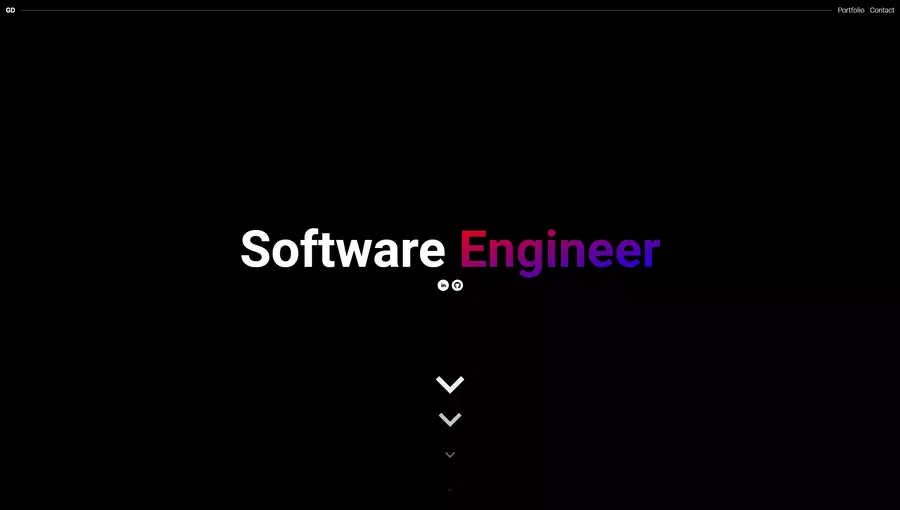

# Website

## About



My website to showcase myself and my portfolio. Visit at [griffindow.com](https://griffindow.com/).

## Features

- Look at my portfolio
- Send an email through the contact form

## Technologies

### Client

- [Pug.js](https://pugjs.org/)
- [Sass](https://sass-lang.com/)
- [TypeScript](https://www.typescriptlang.org/)
- [Webpack](https://webpack.js.org/)

### Server

- [TypeScript](https://www.typescriptlang.org/)
- [Node.js](https://nodejs.org/)
- [AWS SAM](https://aws.amazon.com/serverless/sam/)

### Cloud

- [AWS Route 53](https://aws.amazon.com/route53/)
- [AWS CloudFront](https://aws.amazon.com/cloudfront/)
- [AWS API Gateway](https://aws.amazon.com/api-gateway/)
- [AWS Lambda](https://aws.amazon.com/lambda/)
- [AWS S3](https://aws.amazon.com/s3/)
- [AWS SES](https://aws.amazon.com/ses/)

## Setup

### Client

Setup project

```bash
npm install
```

Run development server

```bash
npm run dev
```

Build for production

```bash
npm run build
```

Deploy to AWS

```bash
npm run deploy
```

### Server

Build files

```bash
sam build
```

Run development server

```bash
sam local start-api
```

Deploy to AWS

```bash
sam deploy
```
